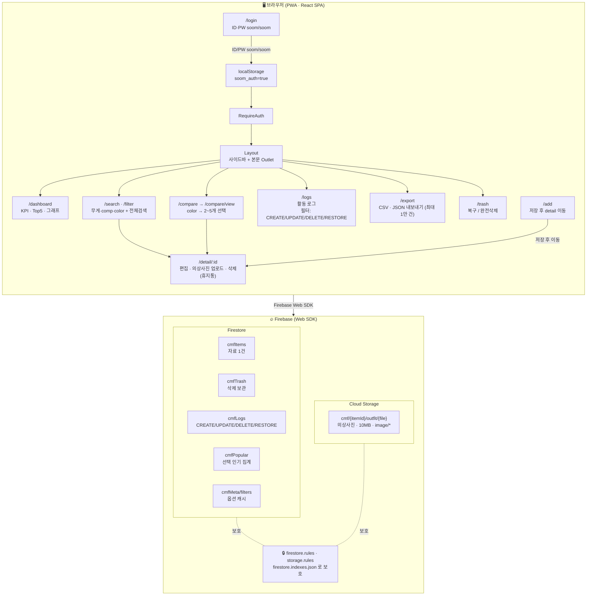
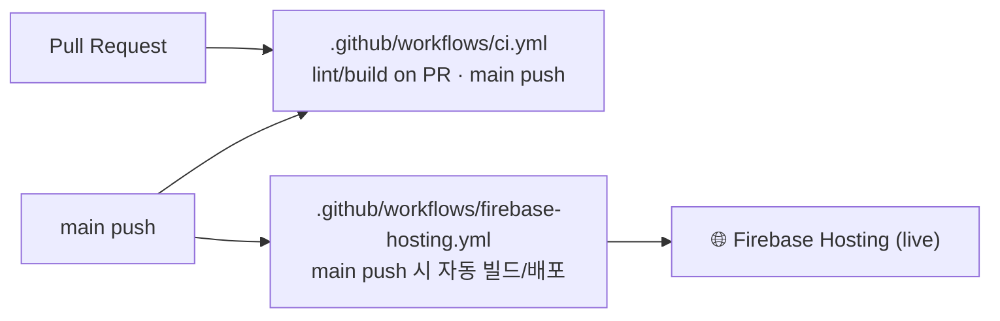

# 숨코리아 CMF Library

> **제작자 / Author — LEE SEUNG JU**

내부 관리자용 CMF(Color · Material · Finish) 패브릭 자료 관리 도구.
React + Vite + Firebase(Firestore · Cloud Storage · Hosting) 기반의 PWA 단일 페이지 앱.

> ### 📌 3줄 요약
> 1. **무엇** — 숨코리아 CMF 패브릭 자료(무게·comp·width·mount·cost·color 등)를 **검색·필터·색상비교·편집·삭제**하는 내부 관리자용 단일 페이지 앱.
> 2. **어떻게** — **React + Vite + Firebase**(Firestore·Cloud Storage·Hosting) 기반 **PWA**. 삭제는 휴지통 격리·복구, 모든 변경은 활동 로그 자동 적재, 대시보드·CSV/JSON 내보내기 제공.
> 3. **운영** — 환경변수 기반 Firebase 구성, Firestore/Storage 보안 규칙, GitHub Actions **CI/자동 배포**까지 갖춘 **운영형 V1.0**.

- 🔑 로그인: **soom / soom**
- 🖼️ 스와치 이미지: **고정 자산**(`src/assets/fixed-swatch.png`) 사용. DB `swatchUrl` 무시.

---

## 🗺️ 1. 동작 구조 흐름

### 1-1. 브라우저(SPA) ↔ Firebase 구조



### 1-2. GitHub Actions 배포 파이프라인



### 1-3. 핵심 데이터 흐름 (5단계)

| # | 단계 | 흐름 |
| :-: | :-- | :-- |
| 1 | **읽기** | 페이지 진입 → Firestore 쿼리(필요 시 `cmfMeta/filters` 캐시) → 로컬/세션 캐시(`localStorage`, `sessionStorage`) → UI 렌더 |
| 2 | **쓰기** | 폼 입력 → `addItem` / `updateItem` → Firestore 갱신 + `cmfLogs` 적재 → 페이지 재조회 |
| 3 | **삭제** | `softDelete` → 원본을 `cmfTrash` 로 이동 + 원 문서 삭제 → 휴지통에서 `restoreFromTrash`(원본 ID 복원) 또는 `deleteTrashPermanently` |
| 4 | **사진** | 클라이언트에서 Cloud Storage `cmf/{itemId}/outfit/*` 로 업로드(10 MB · image/* 검증) → `outfitPhotos` 메타 배열을 `cmfItems` 문서에 머지 |
| 5 | **내보내기** | `listAllItems` → `itemsToCsv`(BOM · CRLF · RFC4180 이스케이프) → 브라우저 Blob 다운로드 |

---

## 📝 2. 기능 간략 설명 (5줄)

1. 숨코리아 CMF 자료(무게·comp·width·mount·cost·color 등)를 Firestore 에서 검색·필터·비교·편집·삭제할 수 있는 단일 관리자 페이지.
2. 대시보드는 총 DB 수, 마지막 업데이트, 인기 Top5, 최근 추가 5건, 14일 수정/등록 추이를 그래프로 제공.
3. 색상 비교(2~5개 동시 비교), 사이드바 다중 필터, 전체텍스트 검색, 의상사진 다중 업로드를 지원.
4. 삭제는 휴지통으로 격리되어 복구·완전삭제가 가능하고, 모든 변경은 활동 로그에 자동 적재.
5. PWA(설치 가능 · 서비스워커 캐시), 환경변수 기반 Firebase 구성, Firestore/Storage 보안 규칙, GitHub Actions CI/배포 워크플로까지 운영형 V1.0 구성을 갖춤.

---

## ⚙️ 3. 기능

> 각 기능 영역은 아래 토글(▶)을 클릭하면 상세 항목이 펼쳐집니다. 라우트/컬렉션/동작은 원문 그대로 보존.

### 📋 기능 영역 한눈에 보기

| 영역 | 라우트 | 핵심 요약 |
| :-- | :-- | :-- |
| 3.1 인증 · 진입 | `/login` | soom/soom 검증, `RequireAuth` 가드, 자동 진입, 로그아웃 |
| 3.2 대시보드 | `/dashboard` | KPI 4개, Top5, 최근 5건, 14일 추이, 쿼터 방어 |
| 3.3 검색 · 필터 | `/search` · `/filter` | 1차 드롭다운, 2차 다중 필터, 전체텍스트, 페이지네이션 |
| 3.4 색상 비교 | `/compare` · `/compare/view` | 2~5개 비교, `cmfPopular` 학습, 비교 표 |
| 3.5 CMF 추가 | `/add` | 12개 필드, 상세정보, 의상사진, 색상 코드 분해 |
| 3.6 상세 · 편집 | `/detail/:id` | 인플레이스 편집, 사진 갤러리, 휴지통 이동 |
| 3.7 휴지통 | `/trash` | 복구(ID 보존), 완전삭제, 세션 캐시 |
| 3.8 활동 로그 | `/logs` | 최근 200건, 액션 뱃지·필터, 상세 이동 |
| 3.9 내보내기 | `/export` | CSV(RFC4180) · JSON, 최대 1만 건 |
| 3.10 공통 UX | – | 모바일 사이드바, 글래스모피즘, PWA, 인쇄 CSS |
| 3.11 안정성 · 운영 | – | ErrorBoundary, 보안 규칙, CI/배포, 캐시 헤더 |

<details>
<summary><strong>🔐 3.1 인증 · 진입</strong></summary>

- **3.1.1** 로그인 페이지(`/login`) – ID/PW(`soom`/`soom`) 검증, 비밀번호 보기 토글
- **3.1.2** 라우트 가드(`RequireAuth`) – 미인증 시 `/login` 으로 리다이렉트
- **3.1.3** 자동 진입 – 인증 후 `/` 접근 시 `/dashboard` 로 이동
- **3.1.4** 로그아웃 – 사이드바 하단 버튼, 모바일 메뉴에서도 동작

</details>

<details>
<summary><strong>📊 3.2 대시보드(<code>/dashboard</code>)</strong></summary>

- **3.2.1** KPI 카드 4개 – 총 DB / 마지막 업데이트 / 가장 많이 사용된 항목 검색 수 / 수정기록 건수
- **3.2.2** 자주 검색되는 항목 Top 5 – `cmfPopular` 집계 + 클릭 시 상세 이동
- **3.2.3** 최근 추가된 DB 5건 – `cmfItems.createdAt DESC` (원본 `id` 기준 상세 이동 버그 수정)
- **3.2.4** 14일 추이 그래프 – 수정기록 / DB 개수 라인차트(SVG, deps 0)
- **3.2.5** 쿼터 초과 방어 – `resource-exhausted` 시 stale 캐시 fallback

</details>

<details>
<summary><strong>🔎 3.3 검색(<code>/search</code>) · 사이드바 필터(<code>/filter</code>)</strong></summary>

- **3.3.1** 1차 드롭다운 – 무게 → comp → color(상위 변경 시 하위 초기화)
- **3.3.2** 2차 사이드바 필터 – 무게/업체명/No/comp/width/mount/cost/color 다중 선택
- **3.3.3** 전체텍스트 검색 – 업체명·No·comp·color·조직·장소·아카이빙·컬렉션·샘플위치 자유 입력
- **3.3.4** 결과 페이지네이션 – 그리드 카드 12개/페이지, 카드별 상세·삭제 액션
- **3.3.5** 필터 메타 캐시 – `cmfMeta/filters` 우선, 없으면 distinct 폴백
- **3.3.6** 라우트 이동 시 사이드바 필터 자동 초기화

</details>

<details>
<summary><strong>🎨 3.4 색상 비교(<code>/compare</code>, <code>/compare/view</code>)</strong></summary>

- **3.4.1** 색상 선택 + 20개/페이지 페이지네이션(`afterId` 스택)
- **3.4.2** 카드 안 체크박스로 2~5개 선택(최대 5 잠금)
- **3.4.3** 선택 시 `cmfPopular` 적재로 대시보드 Top5 학습
- **3.4.4** 비교 뷰 – color/cost/width/mount/comp/무게 표 + 스와치 확대 클릭
- **3.4.5** 목록 우측 삭제(휴지통 이동) – 참조 오류 수정 + 스낵바 피드백
- **3.4.6** 전체 색상 카운트 표시 (`getColorCount`)

</details>

<details>
<summary><strong>➕ 3.5 CMF 추가(<code>/add</code>)</strong></summary>

- **3.5.1** 기본 정보 12개 필드(무게/업체명/No/comp/width/mount/cost/color/조직/전화번호/장소/아카이빙)
- **3.5.2** 펼침형 상세정보 섹션 – 사용여부/사용중 프로젝트(THE GEM/IDEALIAN/NEOR/NEORm/ICONIA)/캐릭터
- **3.5.3** 의상사진 다중 선택 + 미리보기 + 저장 직전 제거
- **3.5.4** 저장 시 Firestore 생성 → Storage 업로드 → outfitPhotos 머지 → 상세 페이지로 이동
- **3.5.5** 색상 코드 자동 분해(`KH/GY/GN/PK` → `colorCodes` 배열, `array-contains` 인덱스 활용)

</details>

<details>
<summary><strong>✏️ 3.6 상세 · 편집(<code>/detail/:id</code>)</strong></summary>

- **3.6.1** 기본 정보 인플레이스 편집 + 더티 체크(변경 없으면 저장 비활성)
- **3.6.2** 상세정보 섹션 별도 저장 버튼
- **3.6.3** 의상사진 섹션 – 저장된 사진 갤러리 + 원본 확대 모달 + 개별 제거 + 신규 업로드(파일별 10MB/image/* 검증)
- **3.6.4** 스와치/저장 사진 확대 모달(ESC 닫기, 바디 스크롤 잠금)
- **3.6.5** 휴지통 이동(softDelete) – 위험 영역 표시 + 확인 팝업

</details>

<details>
<summary><strong>🗑️ 3.7 휴지통(<code>/trash</code>)</strong></summary>

- **3.7.1** 카드 그리드(12/페이지) + 새로고침
- **3.7.2** 복구 – 원본 문서 ID 보존(`originalId`) 복원, 참조 링크 유지
- **3.7.3** 완전삭제 – 확인 팝업 + 스낵바
- **3.7.4** 세션 캐시(뒤로가기 시 UI 유지)

</details>

<details>
<summary><strong>🧾 3.8 활동 로그(<code>/logs</code>)</strong></summary>

- **3.8.1** 최근 200건 조회(`cmfLogs.createdAt DESC`)
- **3.8.2** 액션별 색상 뱃지(CREATE/UPDATE/DELETE/RESTORE) + 필터 토글
- **3.8.3** 대상 ID 클릭 → 상세 페이지 이동(삭제 로그는 비활성)

</details>

<details>
<summary><strong>📤 3.9 내보내기(<code>/export</code>)</strong></summary>

- **3.9.1** CSV 다운로드 – BOM(UTF-8) + CRLF + RFC4180 이스케이프
- **3.9.2** JSON 다운로드 – 정렬된 들여쓰기
- **3.9.3** 최대 10,000건 단일 호출(이후 페이지네이션 확장 여지)

</details>

<details>
<summary><strong>🎛️ 3.10 공통 UX</strong></summary>

- **3.10.1** 모바일 사이드바(햄버거) – 라우트 이동 시 자동 닫힘
- **3.10.2** 글래스 모피즘 디자인 시스템 + Tailwind 유틸리티
- **3.10.3** Snackbar 토스트(자동 닫힘 2.2s) + ESC 모달
- **3.10.4** PWA – manifest + service worker(navigate=network-first, 정적=cache-first, 동일 출처만)
- **3.10.5** 인쇄용 CSS(@media print) – 배경/그림자 제거, 사이드바 숨김
- **3.10.6** 이미지 lazy 로딩 + 모바일 iOS 자동확대 방지

</details>

<details>
<summary><strong>🛡️ 3.11 안정성 · 운영</strong></summary>

- **3.11.1** 전역 `ErrorBoundary` – 흰화면 방지 + 새로고침/로그아웃 옵션
- **3.11.2** 환경변수 기반 Firebase 구성(`.env.example` 제공)
- **3.11.3** Firestore 보안 규칙(`firestore.rules`) + 인덱스(`firestore.indexes.json`)
- **3.11.4** Cloud Storage 규칙(`storage.rules`) – 10MB / `image/*` 한정
- **3.11.5** GitHub Actions – `ci.yml`(빌드) + `firebase-hosting.yml`(main 푸시 배포)
- **3.11.6** `firebase.json` – 정적 자산 immutable 캐시 + `sw.js` no-cache 헤더
- **3.11.7** `.gitignore` – `serviceAccountKey*.json`, `.env*`, `.firebase/` 차단
- **3.11.8** 보안 포스처 문서(`docs/SECURITY.md`), `CHANGELOG.md`

</details>

---

## 💻 4. 로컬 실행

```bash
npm install
cp .env.example .env       # 필요 시 키 교체
npm run dev                # http://localhost:5173
```

## 📥 5. CSV 초기 적재

```powershell
$env:GOOGLE_APPLICATION_CREDENTIALS="C:\path\serviceAccountKey.json"
npm run import:csv -- "C:\path\숨코리아1.csv"
```

## 🚀 6. 배포 (Firebase)

```bash
npm run build
firebase deploy            # hosting + firestore.rules + storage.rules + indexes
```

또는 GitHub Actions: `main` 푸시 → `firebase-hosting.yml` 이 자동 빌드/배포.

**필요한 시크릿:** `FIREBASE_SERVICE_ACCOUNT`, `FIREBASE_PROJECT_ID`, `VITE_FIREBASE_*`.

---

## 📁 7. 디렉터리

```
src/
  components/   Layout, RequireAuth, Snackbar, Swatch, LineChart, ErrorBoundary
  lib/          firebase, firestore, storage, auth, filterContext, pageCache, types
  pages/        Login, Dashboard, Search, Filter, Compare, CompareView,
                Add, Detail, Trash, Logs, Export
  styles/       index.css (Tailwind + glass utilities + print rules)
scripts/        import_csv_to_firestore.mjs
public/         sw.js, manifest.webmanifest, icons/*
docs/           SECURITY.md
firestore.rules · storage.rules · firestore.indexes.json · firebase.json
.github/workflows/ ci.yml · firebase-hosting.yml
```
